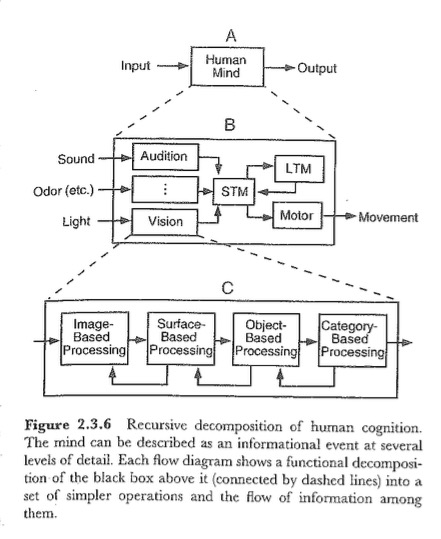
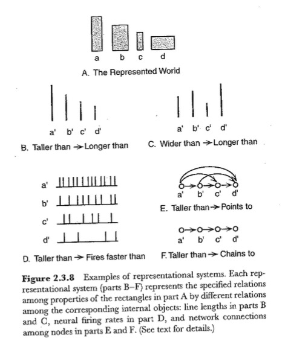
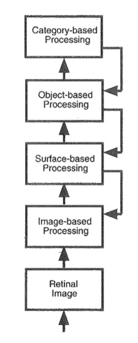

## PSY 525 Cognitive Proseminar

- Vision

## Goals

- Why vision science matters to other areas of cognition
- Some questions I've pursued in vision science
- [Your questions](https://github.com/psu-psychology/psych-525-cog-prosem/blob/master/student-questions.md)

## My trajectory

- B.A., Cognitive Science, Brown
- 7 years in D.C. working as non-profit staffer, lobbyist
- M.S. & Ph.D. in Cognitive Neuroscience, Carnegie Mellon
- 19+ years at PSU

## Seminal events {.flexbox .vcenter}

## Seminal events {.flexbox .vcenter}

## Palmer's claims

1. Perception is knowledge acquisition
2. Knowledge is about objects and events
3. Knowledge is extracted by information processing
4. Information comes from reflected, refracted, or emitted light.

## Things to worry about

- Or general problems that vision science keeps front and center

## Homunculus problem

## [Marr's three levels](http://www.albany.edu/~ron/papers/marrlevl.html)

- Computations
- Algorithms
- Implementations

----

[[@grill-spector_functional_2014]](http://doi.org/10.1038/nrn3747)

## What is information processing, anyway? {.flexbox .vcenter}

----

## What is a representation of property X?

## Modeling the unseen environment

----

Necker cube example.

----

An impossible object.

----

Classic image from M.C. Escher.

## Bottom-up vs. top-down

Funny cartoon showing the difference between bottom-up and top-down processing.

## What must (sighted) animals do?

- Find food
- Find mates
- Avoid predators

## How does vision help them do these things?

- What is it?
- Where is it located or moving?
- How should I respond?

## Classical theories of vision

- "Why do things look as they do?" (Koffka, 1935)
- *Structuralism*: "The (world/visual nervous system) is that way."
- *Empiricism vs. nativism*: "We (learn to/were born to) see them that way."
    
## Classical theories of vision

- *Atomism vs. holism*: "Because of the way (each small piece/the whole visual field) appears."
- *Introspection vs. behavior*: "How things *look* matters (more/less) than what we *do* with the information."
    
## Theoretical approaches and their champions

- Gestaltism, Wertheimer
- Ecological optics, Gibson
- Constructivism, Helmholtz

----

----

----

## Four stages of visual perception

- Image-based
- Surface-based
- Object-based
- Category-based

----

## Hierarchical + parallel processing

## Case studies

- Jayaraman, S., Gilmore, R.O., & Raudies (2016, May). Changes in early optic flow experiences across development and culture. Presentation at the XXth International Congress on Infant Studies. New Orleans, LA. [Talk](https://rawgit.com/gilmore-lab/ICIS-2016-New-Orleans/master/jayaraman-gilmore-raudies-ICIS-2016.html#1)
- Gilmore, R.O., Thomas, A.L., & Fesi, J.D (2016). Children's brain responses to optic flow vary by pattern type and motion speed. PLoS ONE. [doi](http://doi.org/10.1371/journal.pone.0157911). Materials on Databrary at http://doi.org/10.17910/B7QG6W.

## Take homes

- Vision science principles, ideas, theories deeply embedded in other areas of cognitive psychology.

## References

